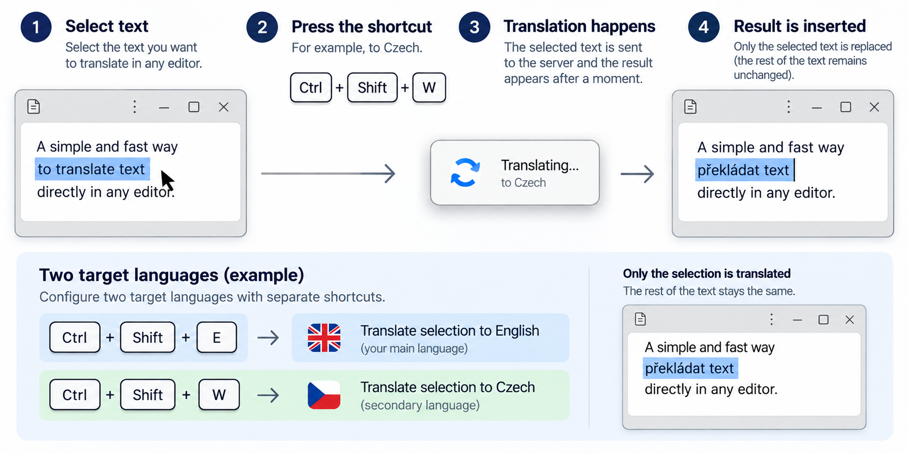

# TranslatePlace

A GNOME Shell extension that translates selected text using
[Tomáš Mark's translation-api](https://github.com/tomasmark79/translation-api)
and optionally pastes the result over the selection.
The interface is English, source detection is automatic, and two target languages
can be configured with separate shortcuts.




## Features

- Translate the selection with a shortcut you choose
- Two target languages with independently configurable shortcuts
- Configurable API address
- Optional automatic replacement of the selected text
- Local history with the original text and translation
- Short history previews in the panel menu and a bounded dialog for full text
- Configurable history length: 1–200 entries, default 50

## Requirements

Declared GNOME Shell version: **50**, as listed in `metadata.json`.
Runtime requires GJS, libsoup 3 and a running translation server; Preferences
also require GTK 4 and libadwaita.
Use [Translation API](https://github.com/tomasmark79/translation-api), a separate
server using Ollama. Follow its README to install the server and language model.

The default endpoint is `http://127.0.0.1:5001`; change it in Preferences under
**Connection → Translation API URL**. The backend must implement the API contract
below. Server installation, configuration and language models are outside this project.

### API contract

- `POST /translate` accepts JSON `{"q": "text", "source": "auto", "target": "en"}`.
  The server responds with HTTP 202 and `{"jobId": "<32 lowercase hex characters>", "status": "pending"}`.
- `GET /translations/<jobId>` returns `{"status": "pending"}`, or
  `{"status": "done", "translatedText": "..."}`, or `{"status": "failed", "error": "..."}`.
- Maximum input: 10,000 characters.

Check that the translation server is running before using the extension:

```bash
curl http://127.0.0.1:5001/health
```

Build tools: Bash, Python 3, Node.js and GJS (syntax/regression checks),
zip and `glib-compile-schemas`. Local installation also requires `gnome-extensions`.
Building does not require a running translation server.

The extension waits up to fifteen minutes per translation, including queue time.
The HTTP session uses a twenty-second network timeout. A request already in
progress can extend beyond the overall polling deadline.

## Installation

From the project directory:

```bash
./build.sh --install
```

On Wayland, log out and back in when needed to load new or changed JavaScript,
then enable the extension:

```bash
gnome-extensions enable translateplace@digitalspace.name
```

Installation updates the user copy without enabling the extension or logging you out.
The build does not install, start or configure the API server.

## Usage

Assign a shortcut in Preferences, then select text in an editable field and press it. The original is
saved to history before the translation request. The panel menu provides history
and Preferences; click a history entry to see the original and translation.
**Delete history** appears when history contains entries and asks for confirmation
before deleting all saved originals and translations.

In **Preferences**, choose a target language and a keyboard shortcut separately for
**TranslatePlace language 1** and **TranslatePlace language 2**. Source language is
always detected automatically. New installations default to English for language 1 and Czech for language 2.
An older installation may retain its previous language 1 through legacy settings.
Both shortcuts start unassigned.
Click **Change…** and
press the desired combination; **Escape** cancels and **Backspace** removes it.
Use Ctrl, Alt or Super with another key, and avoid shortcuts already used by GNOME
or applications. The two language shortcuts must differ. Changes apply without
restarting the extension. Each translation keeps the target chosen when its
shortcut was pressed.

Under **Connection**, set **Translation API URL** and press its apply button.
The default is `http://127.0.0.1:5001`; **Default** restores it. HTTP, HTTPS,
ports and path prefixes (such as `https://example.com/api`) are supported.
Use the base address without `/translate`; credentials, query parameters and
fragments are rejected. Both language shortcuts use the same saved address.
Changes apply to the next translation. A running translation finishes using the
address it started with.

```bash
gnome-extensions prefs translateplace@digitalspace.name
```

### Translation results and history

**Replace selected text** is enabled by default. Turn it off in Preferences to
review translations in history before inserting them. Keep the editor focused
and the text selection unchanged until translation finishes.

**Copy translation to clipboard** is a separate option, disabled by default.
Enable it to keep translations ready for manual pasting, even when automatic
replacement is off. Automatic replacement also puts the translation on the
clipboard. If replacement is skipped, the result remains available in history.
Originals and completed translations are saved in every mode.

History is stored in `$XDG_STATE_HOME/translateplace/history.json`, defaulting to
`~/.local/state/translateplace/history.json`, with permissions 0600. It contains private selected text, including originals retained after API
errors. Consider that content before sharing or backing up the file.

HTTP/HTTPS URLs, emoji, fenced and inline code, HTML tags, Markdown links and
selected Markdown markers are masked during translation. The model can still omit
or move protected parts; history reports detected discrepancies. These warnings
do not prevent automatic paste when it is enabled. The original remains available.
Formatting outside the text, such as WYSIWYG styles, may be lost when pasting plain text.

## Development

```bash
./build.sh --check
./build.sh
```

Both commands validate metadata, JavaScript and the XML schema and run regression
tests for text protection, language settings, shortcuts, API addresses/timeouts,
clipboard handling, extension lifecycle and history. The output is `dist/translateplace@digitalspace.name.zip`.
`-b` and `-r` are build aliases; `-i`, `-bi` and `-ri` build current sources and install them.

Compare with a separately saved reference archive, if available:

```bash
./build.sh --compare-zip /path/to/previous-translateplace.zip
```

This checks identical paths and bytes for every packaged file, including metadata.
ZIP timestamps and compression may differ. A metadata update also counts as a difference.
The package contains runtime JavaScript, metadata, the license and the XML schema; GNOME compiles
the schema during installation. The translation server and tests are not bundled.

Project: [TranslatePlace](https://github.com/tomasmark79/TranslatePlace).
The translation server is maintained in the separate
[Translation API repository](https://github.com/tomasmark79/translation-api).

For runtime changes, check text replacement, automatic paste disabled, history,
long-text dialogs, API errors and disable/enable during a pending translation in
GNOME. Build checks alone do not verify clipboard behavior in the running session.

## Troubleshooting

If the API cannot be reached, check your configured server's health endpoint and
its process or service (for example, `translation-api.service` for a service deployment). If automatic paste is skipped, check window focus,
clipboard changes and editor shortcut support; the result remains in history.
Start a fresh GNOME session if an installed code change does not appear.
Report problems in the [issue tracker](https://github.com/tomasmark79/TranslatePlace/issues).

## License

TranslatePlace is licensed under the GNU General Public License, version 3 or
any later version (SPDX: `GPL-3.0-or-later`). See [LICENSE](LICENSE).

[GitHub](https://github.com/tomasmark79/TranslatePlace) · [Donate via PayPal](https://paypal.me/TomasMark)
