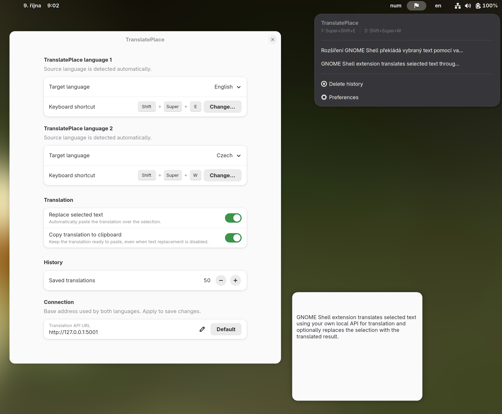

# TranslatePlace

A GNOME Shell extension that translates selected text through your own
translation API and optionally pastes the result over the selection.
The interface is English, source detection is automatic, and two target languages
can be configured with separate shortcuts.



## Features

- Translate the selection with **Super + Shift + E**
- Two target languages with independently configurable shortcuts
- Configurable API address
- Optional automatic replacement of the selected text
- Local history with the original text and translation
- Short history previews in the panel menu and a bounded dialog for full text
- Configurable history length: 1–200 entries, default 50

## Requirements

Declared GNOME Shell version: **50**, as listed in `metadata.json`.
Runtime requires GJS, libsoup 3, libadwaita and the private translation API.

The default endpoint is `http://127.0.0.1:5001`; change it in Preferences under
**Connection → Translation API URL**. The backend must implement the API contract
below. Server installation, configuration and language models are outside this project.

### API contract

- `POST /translate` accepts JSON `{"q": "text", "source": "auto", "target": "en"}`.
  The server responds with HTTP 202 and `{"jobId": "<32 lowercase hex characters>", "status": "pending"}`.
- `GET /translations/<jobId>` returns `{"status": "pending"}`, or
  `{"status": "done", "translatedText": "..."}`, or `{"status": "failed", "error": "..."}`.
- Maximum input: 10,000 characters.

Check that the private server is running before using the extension:

```bash
curl http://127.0.0.1:5001/health
```

Build tools: Bash, Python 3, Node.js (syntax checks), GJS (text protection tests),
zip and `glib-compile-schemas`. Local installation also requires `gnome-extensions`.
Building does not require a running translation server.

## Installation

From the project directory:

```bash
./build.sh --install
```

On Wayland, log out and back in when needed to load new or changed JavaScript,
then enable the extension:

```bash
gnome-extensions enable translateplace@digitalspace.name
```

Installation updates the user copy without enabling the extension or logging you out.
When replacing an older installation with UUID `translateplace@tomasmark79`, disable
that copy before enabling the new one. The settings schema and history path remain
the same.
The build does not install, start or configure the API server.

## Usage

Select text in an editable field and press **Super + Shift + E**. The original is
saved to history before the translation request. The panel menu provides history
and Preferences; click a history entry to see the original and translation.
**Delete history** appears when history contains entries and asks for confirmation
before deleting all saved originals and translations.

In **Preferences**, choose a target language and a keyboard shortcut separately for
**TranslatePlace language 1** and **TranslatePlace language 2**. Source language is
always detected automatically. Language 1 defaults to English and retains the
existing **Super + Shift + E** shortcut (including any user customization).
Language 2 defaults to Czech and starts without a shortcut. Click **Change…** and
press the desired combination; **Escape** cancels and **Backspace** removes it.
Use Ctrl, Alt or Super with another key, and avoid shortcuts already used by GNOME
or applications. The two language shortcuts must differ. Changes apply without
restarting the extension. Existing Czech/English direction settings preserve their
target language for language 1. Each translation keeps the target chosen when its
shortcut was pressed. The menu keeps its existing layout.

Under **Connection**, set **Translation API URL** and press its apply button.
The default is `http://127.0.0.1:5001`; **Default** restores it. HTTP, HTTPS,
ports and path prefixes (such as `https://example.com/api`) are supported.
Use the base address without `/translate`; credentials, query parameters and
fragments are rejected. Both language shortcuts use the same saved address.
Changes apply immediately.

```bash
gnome-extensions prefs translateplace@digitalspace.name
```

### Clipboard and history

Selection capture and pasting use **Ctrl + C** and **Ctrl + V** inside GNOME Shell.
The shortcut is skipped in terminals because Ctrl + C could interrupt a running
command. Editors must support those shortcuts and retain the selection; otherwise
copy the translation from history manually.

Automatic paste occurs only while the same window remains active and the clipboard
has not changed since selection capture. After a successful paste, the clipboard
contains the translation. Disable automatic paste in Preferences to review results
before inserting them. Enable **Copy translation to clipboard** independently
to keep the translated text ready for manual paste, including when automatic
replacement is disabled. History is saved in every mode. Automatic replacement
also uses the clipboard to paste on Wayland.

History is stored in `~/.local/state/translateplace/history.json` with permissions
0600. It contains private selected text, including originals retained after API
errors. Consider that content before sharing or backing up the file.

URLs, emoji, code blocks, HTML tags and Markdown links/emphasis are masked during
translation. The model can still omit or move protected parts; the result is pasted
and history reports missing or changed parts. The original remains available.
Formatting outside the text, such as WYSIWYG styles, may be lost when pasting plain text.

## Development

```bash
./build.sh --check
./build.sh
```

Both commands validate metadata, JavaScript and the XML schema and run the existing
text protection, language settings and shortcut regression tests. The output is `dist/translateplace@digitalspace.name.zip`.
`-b` and `-r` are build aliases; `-i`, `-bi` and `-ri` build current sources and install them.

Compare with a separately saved reference archive, if available:

```bash
./build.sh --compare-zip /path/to/previous-translateplace.zip
```

This checks identical paths and bytes for every packaged file, including metadata.
ZIP timestamps and compression may differ. A metadata update also counts as a difference.
The package contains runtime JavaScript, metadata and the XML schema; GNOME compiles
the schema during installation. The private server and tests are not bundled.

Project: [TranslatePlace](https://github.com/tomasmark79/TranslatePlace).
The API backend remains private and is not included in the public repository.

For runtime changes, check text replacement, automatic paste disabled, history,
long-text dialogs, API errors and disable/enable during a pending translation in
GNOME. Build checks alone do not verify clipboard behavior in the running session.

## Troubleshooting

If the API cannot be reached, check the local health endpoint and
`translation-api.service`. If automatic paste is skipped, check window focus,
clipboard changes and editor shortcut support; the result remains in history.
Start a fresh GNOME session if an installed code change does not appear.
Report problems in the [issue tracker](https://github.com/tomasmark79/TranslatePlace/issues).

## License

No project-wide LICENSE file is currently provided.

[GitHub](https://github.com/tomasmark79/TranslatePlace) · [Donate via PayPal](https://paypal.me/TomasMark)
